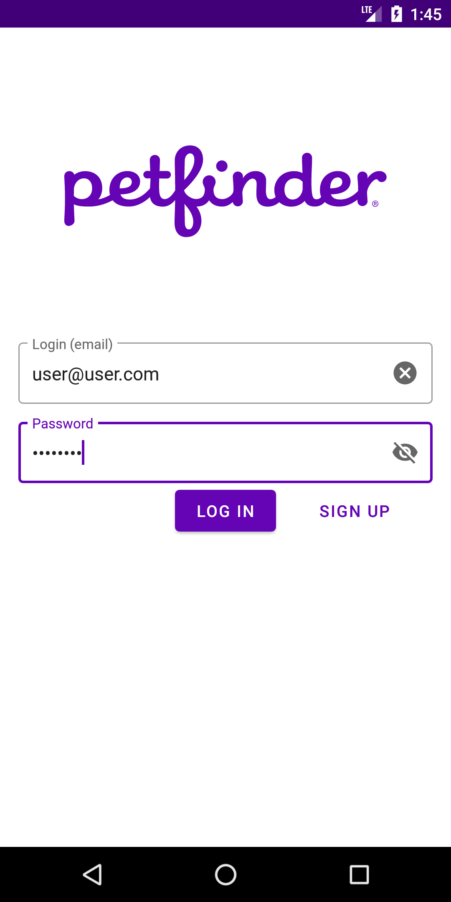
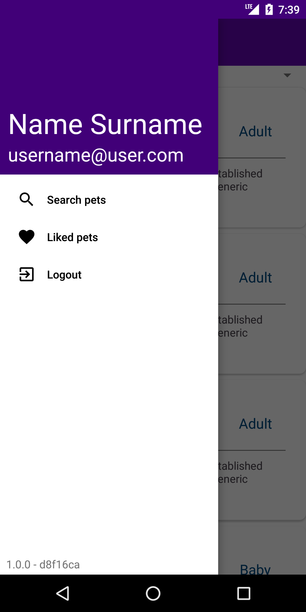
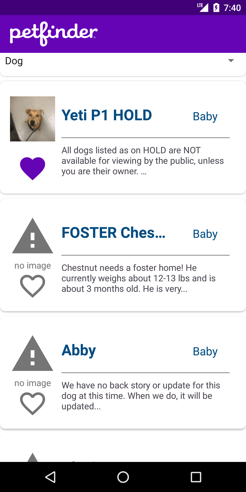

# Unofficial [Petfinder][site] app

This is an unofficial Android client for [Petfinder][site] site.

  

## Current functionality
* View list of pets by type
* Add/remove pets to favorites
* View favorite pets

## Project layout
Just like in any standard Android Studio project based on Gradle, the root 
folder has `build.gradle` file for the project, `gradle.properties`, and 
`settings.gradle`.

The app's module is located at the `app` folder. Here is the `build.gradle` 
for the module, `proguard-rules.pro` file with Proguard rules and `src/main` directory. 

At the `src/main` directory there are 3 children:
* `java/com/mexator/petfinder_client` - Folder that contains all the packages 
with source code of the app 
* `res` - Application's resources: Strings, drawables, etc. 
* `AndroidManifest.xml` - Android application manifest file

## Packages structure
* **data** contains all classes that constitute "Model" part of MVVM 
architecture 
* **di** package contains [Koin] modules, that are used for [DI] 
* **extensions** package contains the only file - `Extensions.kt` where all 
extension function defined at this project are located
* **mvvm** package contains MVVM ViewModel's and ViewState's associated with 
them
* **network** package contains all utility classes for interaction with 
network, e.g. OkHTTP interceptors, class for checking internet connection 
availability
* **storage** package contains StorageManager class, that is intended to work 
with reading/writing data to SharedPreferences
* **ui** package contains Activity and Fragment classes, and custom Views and 
Adapters.
* **utils** package contains general-purpose utility functions and classes

[site]:https://www.petfinder.com/
[Koin]:https://github.com/InsertKoinIO/koin
[DI]:https://en.wikipedia.org/wiki/Dependency_injection